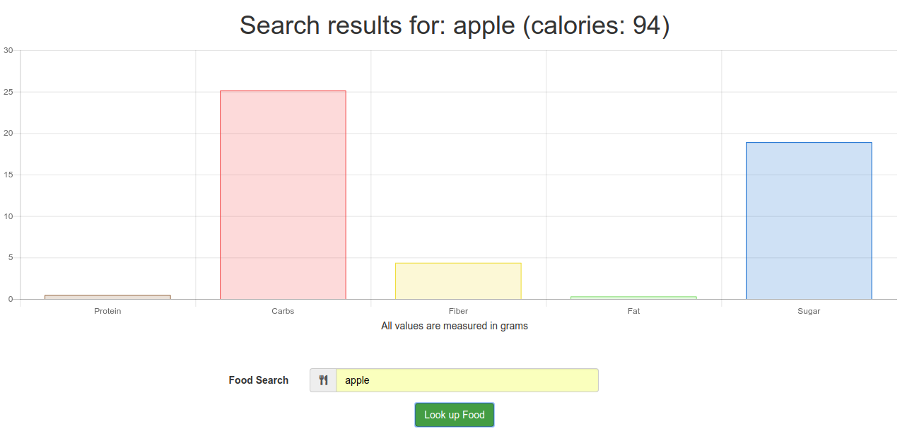

# Nutrition-Food-Graph
* A web application for CSC 360

This application displays nutritional values of diffrent food back to the user in a graph form.

## Running
To Run the application you have to:
1. Clone the repository
2. Go inside the website repository: `cd Nutrition-Food-Graph/website`
3. Install all the dependencies: `npm install`
4. Serve the application: `ng serve --open`

Your browser should automatically open up to `http://localhost:4200/`

## Testing
Make sure all the dependencies are installed first before testing with: : `npm install`

Run `ng test` to execute the unit tests via [Karma](https://karma-runner.github.io).

Run `ng e2e` to execute the end-to-end tests via [Protractor](http://www.protractortest.org/).
